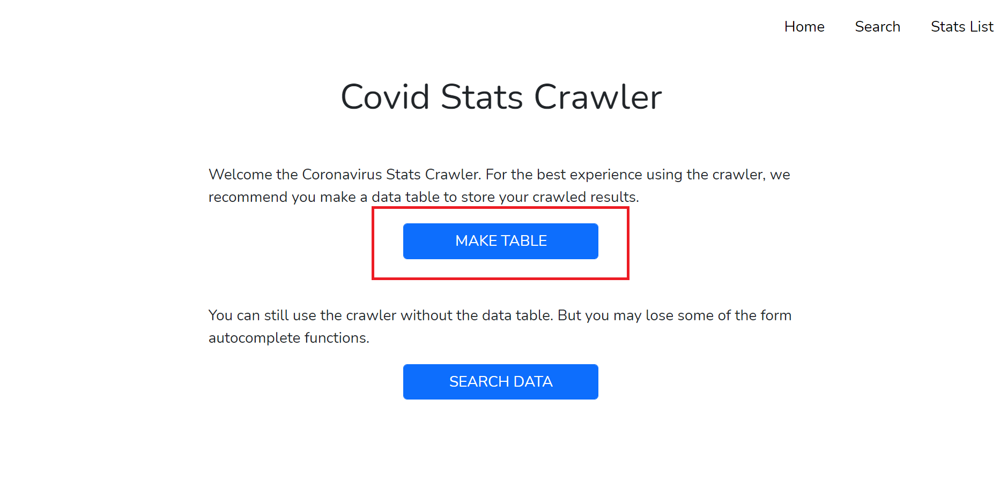
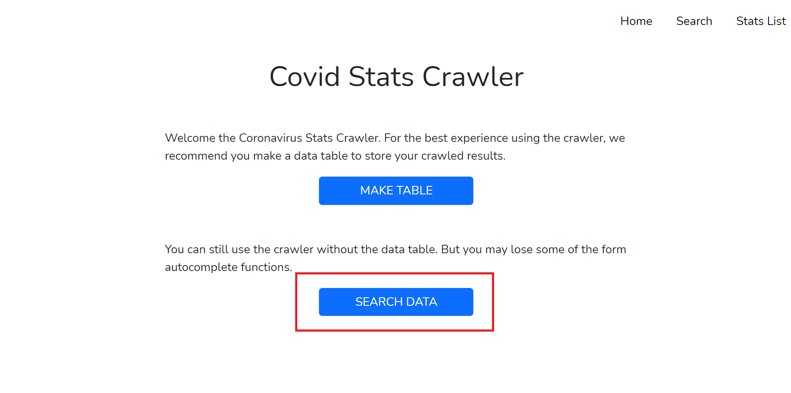

# Laravel Web Crawler Coding Test

## How it works

The project has 2 crawlers:

1. The search crawler

- crawler returns a page with a single set of data

2. The list crawler

- crawler returns a page with a paginated list of all data

## Pages

### Index

See full HTML code here: [welcome.blade.php](https://github.com/markoco14/laravel-scraper/blob/main/resources/views/welcome.blade.php)

The index page is the landing page for the website. This page provides 2 links for the user:

1. Data Init Link

	- The user clicks this link to set up their database and table for the web crawlers. Initializing the database and table is not necessary for the crawlers to work.

	- The user only needs to ensure they have a database connection. I recommend the user clone the repo and use their localhost. The localhost will let the program automatically add tables and data because the .env connections are already preset.



2. Search Data Link

	- The user clicks this link if they want to skip the database and table set up. The project still works if users don't set up the database. The search and list views are created from crawlers data. The list view pagination is also created from crawlers data.



### Database Init

See full HTML code here: [data-init.blade.php](https://github.com/markoco14/laravel-scraper/blob/main/resources/views/data-init.blade.php)

See Controller code here: [DataInitController.php](https://github.com/markoco14/laravel-scraper/blob/main/app/Http/Controllers/DataInitController.php)


The Database Init page helps the user set up the database. When the page loads, the Controller will check if the 'links' table exists.

If the 'links' table doesn't exist, the controller will make the table in the database using the Schema. The user needs to make sure their database connection is properly configured.

The .env file is already configured to use localhost for the database connection. And the database is name is set to "coronavirus_scraper_data". I used PHPMyAdmin to hold the database and tables but the user may change the configurations to suit their needs.


If the 'links' table does exist, the controller tells the user the table is ready.

Once the 'links' table is created, the user can click the CHECK DATA button to go to the Table Init Page.


### Table Init

See full HTML code here: [data-ready.blade.php](https://github.com/markoco14/laravel-scraper/blob/main/resources/views/data-ready.blade.php)

See Controller code here: [TableFillController.php](https://github.com/markoco14/laravel-scraper/blob/main/app/Http/Controllers/TableFillController.php)


///////////////////////////////////////////////////
ADD A SAMPLE TABLE TO THE WEBSITE
///////////////////////////////////////////////////

The Table Init page fills the table with data. First it checks if the 'links' table is empty or not.

If the 'links' table is empty, the program will run an INSERT query. crawl the data and insert it into the database. The crawler will collect the country names, search hrefs, confirmed cases, deaths, and recovered cases.

If the 'links' table is not empty, the program will assume the data has already been collected and will run an UPDATE query. The data will crawl the confirmed cases, deaths, and recovered cases for each country and update the table. This makes sure the data is always up-to-date. 


### Search

See full HTML code here: [search.blade.php](https://github.com/markoco14/laravel-scraper/blob/main/resources/views/search.blade.php)

See Controller code here: [SearchController.php](https://github.com/markoco14/laravel-scraper/blob/main/app/Http/Controllers/SearchController.php)

The search page lets the user search the entire [worldometer website](https://www.worldometers.info/coronavirus/) for worldwide coronavirus stats, or stats from any country of their choosing. 


The base URL for worldometer is placed in the main search input by default. The user can choose between a "Worldwide" search and a "Country" search.

When the "Country" selector is chosen, the country name input appears below.


### Search Results

See full HTML code here: [scraper.blade.php](https://github.com/markoco14/laravel-scraper/blob/main/resources/views/scraper.blade.php)

See Controller code here: [ScaperController.php](https://github.com/markoco14/laravel-scraper/blob/main/app/Http/Controllers/ScraperController.php)

````
<div class="container">
	<?php 

		if($dataThree === "Worldwide") {
			$the_title = "Worldwide";
		} else {
			$h1_titles = array_values($dataThree);
			$the_title = $h1_titles[0];
		}
		// echo $h1_titles[0]; 
	?>
	<h1 class="heading text-center"><?php echo $the_title ?> Coronavirus Stats</h1>
	<div >
		<div class="col-sm-8 offset-sm-2 mt-5 wrapper">
			<?php 
				$combined_data = array_combine($data, $dataTwo);
				// print_r($combined_data);
				// echo $dataThree[" Iran"];
			?>
			@foreach($combined_data as $key => $value)
				<div class="card text-center mt-4">
			
					<h5 class="card-header">{{$key}}</h5>

				<div class="card-body">
					<p class="card-text">{{$value}}</p>
				</div>
			</div>
			@endforeach
			
		</div>
		<a class="btn btn-primary col-sm-4 offset-sm-4 mt-3 wrapper" href="/search">BACK TO SEARCH</a>
	</div>

</div>
````

The search results page returns a single set of data. If the user searches "Worldwide" covid stats, then the the page will show only the worldwide stats. If the user searches for "Canada" covid stats, then the page will only show covid stats for Canada (see picture below).


### List

See full HTML code here: [list.blade.php](https://github.com/markoco14/laravel-scraper/blob/main/resources/views/list.blade.php)

See Controller code here: [ListScraperController.php](https://github.com/markoco14/laravel-scraper/blob/main/app/Http/Controllers/ListScraperController.php)

````
<div class="container">
	<h1 class="heading text-center">Covid Stats Country List</h1>
	<p class="col-md-6 offset-md-3 mt-5 wrapper">Click on any of the links below to see their stats on worldometer.com</p>
	<div class="row">
		<div id="country-list" class="col-md-6 offset-md-3  mt-5 wrapper">
			<ul class="list-group list-group-flush">
				<!-- attempt pagination with scraper data -->
				<?php 
					// print_r($paginators);
					// dd($paginators);
					// dd($paginators);

				 ?>
				 @foreach($paginators as $key => $value)
				 	<?php 

					 	$url = 'https://www.worldometers.info/coronavirus/' . $value;
					 	// $value = str_replace("country", "", $value);
					 	// $value = str_replace("/", "", $value);
					 	// // echo $url;
				 		// echo $key;
				 	?>		
				 	<a class="list-group-item list-group-item-action" target="_blank" href="{{$url}}"><li>{{$key}}</li></a>
				 @endforeach
			</ul>
		</div>
	</div>
	<span id="page-selectors">{{ $paginators->links() }}</span>
</div>
````

The List page returns a full list of every country. Each country name contains a direct link to the worldometer page where users can see the stats for the selected country.


The results are paginated directly from the scraper results. 

## Other Sections

### Models

The project uses one model called Link. It is used to connect automatically to the table titled 'links'.

### Schema 

The project uses the Schema to create the table for the user. See code sample below.

```
Schema::create('links', function (Blueprint $table) {
            $table->id();
            $table->string('display_name');
            $table->string('autocomplete_tag');
            $table->string('complete_url');
            $table->string('country_code');
            $table->string('cases')->default("");
            $table->string('deaths')->default("");
            $table->string('recovered')->default("");
            $table->timestamps();
        }); 

```